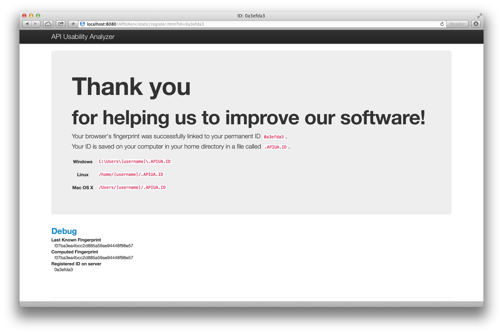
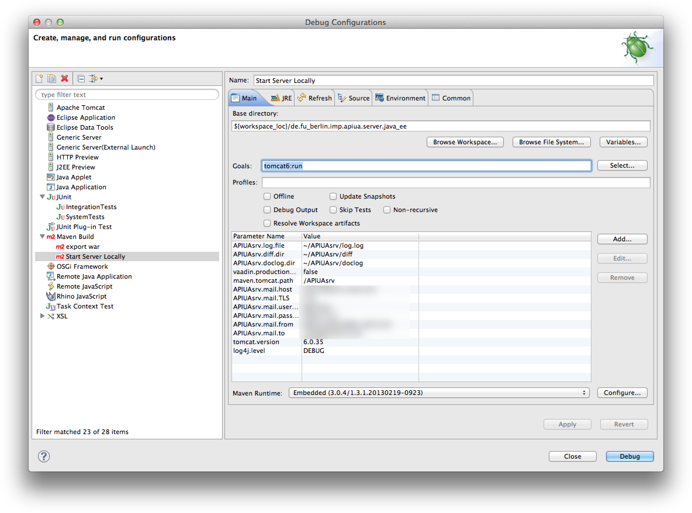
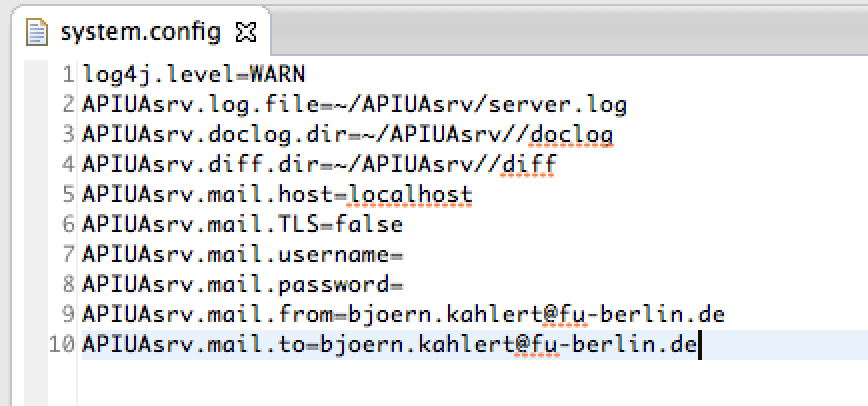
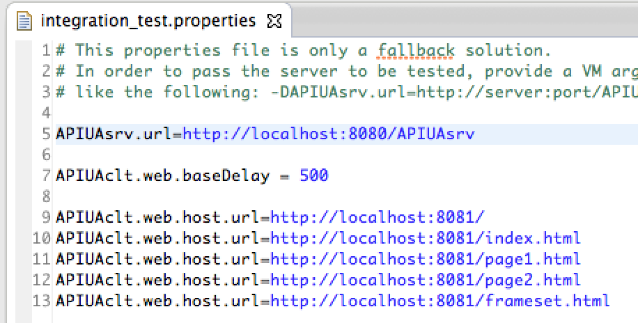
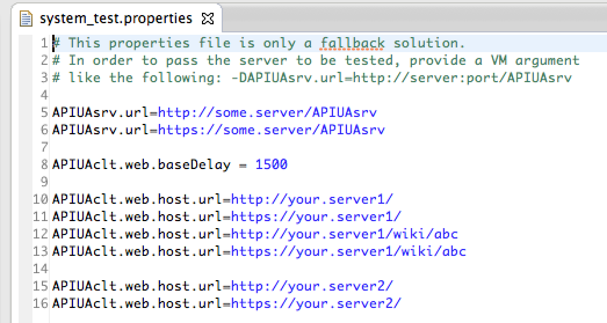

# API Usability Analyzer Server for Java EE

This repository hosts the Java EE based Server that can be used to collect data that you can analyze using the [API Usability Analyzer](https://github.com/bkahlert/api-usability-analyzer).

## Getting Started
1. Fork this repository
2. Import the repository as an Eclipse project in your Eclipse Java EE edition
3. Run/Debug "Start Server Locally.launch"

The Data Collection server is now listening on [http://localhost:8080/APIUAsrv/](http://localhost:8080/APIUAsrv/).  
(Please note that the front end has not been finished and is currently not working.)

The collected data can be found in the directory ~/APIUAsrv.

## What does the server collect?
### Programming progress files (diff)
Those files are zip archives comprising the files a developer changes during two moments in time (e.g. between two builds).

You need to implement a solution that generates and uploads the data. A python based solution can be found on [https://github.com/bkahlert/api-usability-analyzer-client-python](https://github.com/bkahlert/api-usability-analyzer-client-python).

What the client basically does is an HTTP PUSH request on [http://localhost:8080/APIUAsrv/diff/0a3efda3](http://localhost:8080/APIUAsrv/diff/0a3efda3) (whereas 0a3efda3 is the user's ID you define) with a file with the following name scheme: [USER_ID]_[LOCATION_ID]_[DATE].diff.zip.

- The location id can be used if a subject uses different development environments (computers, IDEs, ...).
- The date must be in ISO8601 format.
- An example for a valid filename would be: 0a3efda3_f0c2_2014-07-10T15-33-31.555658+0200.diff.zip

To check if a file was correctly uploaded a list of all uploaded files with an HTTP GET request on [http://localhost:8080/APIUAsrv/diff/0a3efda3](http://localhost:8080/APIUAsrv/diff/0a3efda3) (whereas 0a3efda3 is the user's ID you define) can be made. This way you can now only check the upload success but also implement a synchronisation so your subjects can also work offline.

### Webpage Usage (doclog)
If you provide an online documentation you might also want to know what people did on it when they programmed using your API.

The actions made on your online documentation can be tracked by simply adding the following code right before the ending body-tag.

```HTML
<script src="//ajax.googleapis.com/ajax/libs/jquery/1.7.1/jquery.min.js"></script>
<script>window.jQuery || document.write('<script src="' + ('https:' == document.location.protocol ? 'https://' : 'http://') + 'dalak.imp.fu-berlin.de/APIUAsrv/static/js/libs/jquery-1.7.1.min.js"><\/script>')</script>
<script type="text/javascript">
(function() {
  var APIUAclt = document.createElement('script'); APIUAclt.type = 'text/javascript';
  APIUAclt.src = ('https:' == document.location.protocol ? 'https://' : 'http://') + 'localhost:8080/APIUAsrv/static/js/APIUAclt.js';
  var s = document.getElementsByTagName('script')[0]; s.parentNode.insertBefore(APIUAclt, s);
})();
</script>
```

This includes a JavaScript file that tracks FOCUS, BLUR, SCROLL and some other events and adds them to a TSV file.

The API Usability Analyzer can generate screenshots out of the collected data. The tracking code circumvents browser security restrictions and enables the detection of different users.

### Linking the data
Now that you know what people programmed and what they did on your webpages the question is how to detect which programming history belongs to which browsing history. The web tracking code uses browser fingerprinting and cookies to keep track of the same subject.
To let the server know who is who you need to make a call to https://localhost:8080/APIUAsrv/static/register.html?id0a3efda3 (whereas 0a3efda3 is the user's ID you define).  
You can always open [http://localhost:8080/APIUAsrv/](http://localhost:8080/APIUAsrv/) to check the link state of the used browser/subject.


The above mentioned python implementation does so on the subject's first compilation attempt. It checks if hidden file containing the user's id exists. If not it creates one, writes it to the file and opens the web page in the default browser.

From now on all actions done on the observed web pages made with the linked browser are tracked.

## Configuration

The locally running test and the globally running production server can be configured independently.

You can configure
- the location of the log file (and its verbosity)
- the location of the diff files
- the location of the doclog files
- mail settings to be used if an error occurs

The local configuration file can be changed using the Eclipse Run Project Wizard.


The production configuration file can be directly changed at system.config.


## Testing

First the unit tests can be run without a server by executing UnitTests.java.

Second the running system can be tested in two flavors:
1. The locally running server (that needs to be started separately) can be tested using IntegrationTests.launch. The corresponding configuration can be found in src/test/resources/de/fu_berlin/imp/apiua/server/java-ee/integration_test.properties.  

2. The globally running production server can be tested using SystemTests. The corresponding configuration can be found in src/test/resources/de/fu_berlin/imp/apiua/server/java-ee/system_test.properties.  


Each properties file contains information about the location of the data collection server and the pages that have the data collection script included.

## Deployment

The deployment is fairly easy. All you need to do is
1. confige system.config
2. Run "Export WAR.launch"
3. Deploy the generated APIUAsrv.war to your Java EE server.

Now add the data tracking snippet (see above) to all your web pages where you want to track your subjects and you're done.

It is strongly recommended that you add some web page addresses to your system_test.properties and run the system tests to make sure the data collection is properly working.

License
-------

[The MIT License (MIT)](LICENSE)  
Copyright (c) 2011-2014 [Björn Kahlert, Freie Universität Berlin](http://www.mi.fu-berlin.de/w/Main/BjoernKahlert)